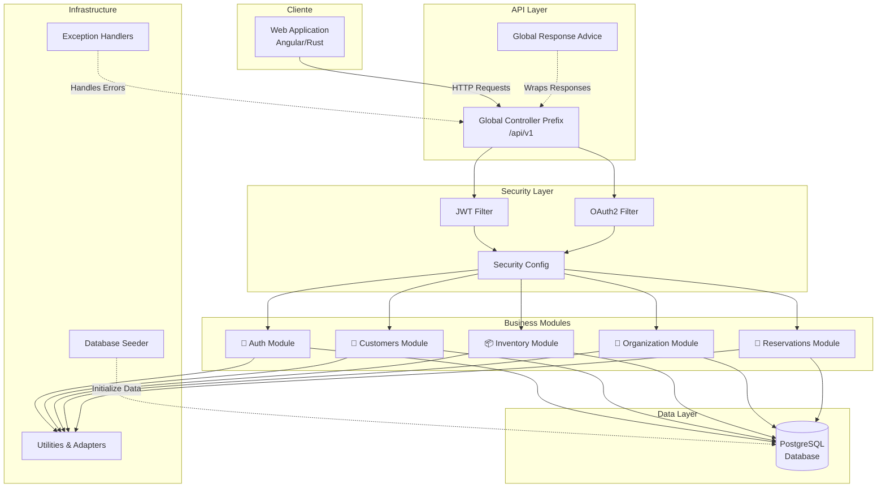
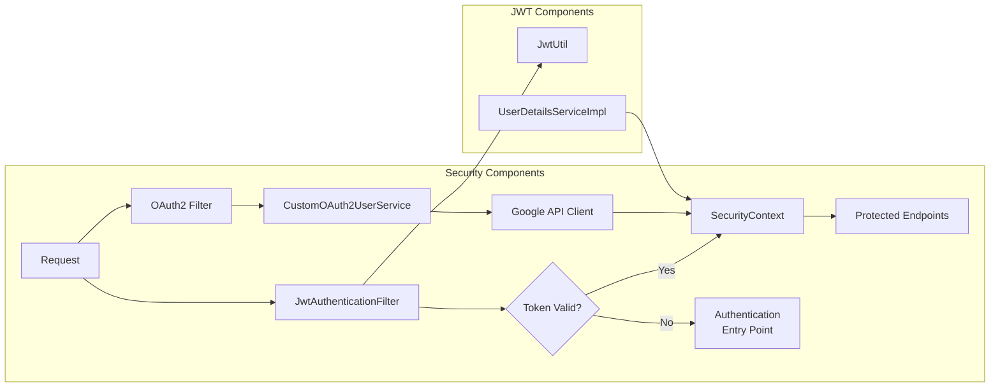
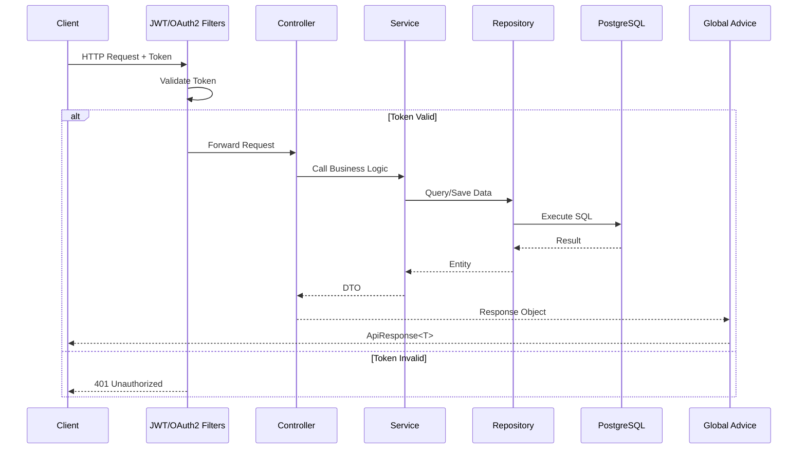

# Detail Shop API

Sistema de gestión backend para retail, construido con Spring Boot. Este sistema administra el inventario, ventas, reservaciones y estructura organizacional para un negocio de venta al detalle.

## � Visión General del Sistema

**Framework:** Spring Boot 3.3.4  
**Lenguaje:** Java 21  
**Base de Datos:** PostgreSQL  
**Patrón Arquitectónico:** Hexagonal (Puertos y Adaptadores) + Modular

---

## 🏗️ Arquitectura de Alto Nivel



---

## 🔐 Capa de Seguridad



**Componentes de Seguridad:**
- `JwtAuthenticationFilter` - Filtro para validar tokens JWT
- `OAuth2AuthenticationSuccessHandler` - Manejo de autenticación OAuth2
- `CustomOAuth2UserService` - Servicio personalizado para OAuth2
- `SecurityConfig` - Configuración central de seguridad
- `JwtUtil` - Utilidad para generación/validación de JWT
- `UserDetailsServiceImpl` - Implementación de UserDetails

---

## 📦 Arquitectura Modular (Hexagonal)

Cada módulo sigue el patrón de arquitectura hexagonal:

```mermaid
graph TB
    subgraph "Module Structure (Hexagonal Architecture)"
        subgraph "Infrastructure Layer (Adapters)"
            CTRL[Controllers<br/>@RestController]
        end
        
        subgraph "Application Layer (Use Cases)"
            SVC[Services<br/>@Service]
        end
        
        subgraph "Domain Layer (Core)"
            ENT[Entities<br/>@Entity]
            DTO[DTOs]
            MAP[Mappers<br/>MapStruct]
            ENUM[Enums]
            REPO[Repositories<br/>@Repository]
        end
        
        CTRL -->|Uses| SVC
        SVC -->|Uses| REPO
        SVC -->|Uses| MAP
        MAP -->|Maps| ENT
        MAP -->|To/From| DTO
        REPO -->|Persists| ENT
        ENT -->|References| ENUM
    end
```

---

## 🗂️ Módulos de Negocio

### 1️⃣ Auth Module (Autenticación y Autorización)

**Funcionalidades:**
- Gestión de usuarios y empleados
- Autenticación JWT y OAuth2 (Google)
- Sistema de roles y permisos (RBAC)
- Perfiles de usuario
- Auditoría de acciones
- Historial de contraseñas
- Tipos de posición laboral

**Componentes principales:**
- Controllers: `UserController`, `RoleController`, `PermissionController`, `PositionTypeController`, `GoogleIDKeyController`
- Services: `UserService`, `AuthService`, `GoogleAuthService`, `RoleService`, `PermissionService`, `AuditService`
- Entities: `User`, `Employee`, `Role`, `Permission`, `Profile`, `PositionType`, `AuditLog`, `PasswordHistory`

---

### 2️⃣ Customers Module (Clientes)

**Funcionalidades:**
- Gestión de clientes
- Tipos de cliente (Enum)
- Mapeo automático con MapStruct

---

### 3️⃣ Inventory Module (Inventario)

El módulo más complejo del sistema, con tres sub-módulos principales:

#### 1. Product Management:
- Productos y paquetes de productos
- Lotes de inventario
- Unidades de producto
- Configuración de precios por sucursal
- Importación masiva de productos

#### 2. Inventory Control:
- Control de inventario
- Movimientos de inventario
- Sistema Kardex
- Gestión de lotes

#### 3. Business Operations:
- Cotizaciones (Quotes)
- Órdenes de trabajo (Work Orders)
- Ventas (Sales)
- Créditos
- Pagos
- Órdenes de compra

**Controllers:** `ProductController`, `CategoryController`, `SupplierController`, `InventoryController`, `QuoteController`, `WorkOrderController`, `SaleController`, `CreditController`, `ProductKardexController`, `ProductUnitController`, `ProductBulkController`, `ProductImportController`

---

### 4️⃣ Organization Module (Organización)

**Funcionalidades:**
- Multi-company (Multi-empresa)
- Gestión de sucursales
- Gestión de almacenes
- Jerarquía organizacional

**Jerarquía:** Company → Branch → Warehouse

---

### 5️⃣ Reservations Module (Reservaciones)

**Funcionalidades:**
- Sistema de reservaciones
- Detalles de reservaciones

---

## 💾 Modelo de Datos Relacional

```mermaid
erDiagram
    %% Auth Domain
    User ||--o{ Employee : "has"
    User ||--|| Profile : "has"
    User }o--|| Role : "has"
    Role }o--o{ Permission : "has"
    Employee }o--|| PositionType : "has"
    User ||--o{ PasswordHistory : "tracks"
    User ||--o{ AuditLog : "generates"
    
    %% Organization Domain
    Company ||--o{ Branch : "owns"
    Branch ||--o{ Warehouse : "contains"
    Branch ||--o{ Employee : "employs"
    
    %% Customers Domain
    Client ||--o{ Sale : "makes"
    Client ||--o{ Credit : "has"
    Client ||--o{ Reservation : "books"
    
    %% Inventory Domain - Products
    Category ||--o{ Product : "categorizes"
    Supplier ||--o{ Product : "supplies"
    Product ||--o{ ProductUnit : "has units"
    Product ||--o{ ProductBundle : "bundled in"
    Product ||--o{ InventoryBatch : "tracked in"
    
    %% Inventory Domain - Stock
    Branch ||--o{ Inventory : "manages"
    Product ||--o{ Inventory : "stored as"
    Warehouse ||--o{ Inventory : "stores"
    Inventory ||--o{ InventoryMovement : "has movements"
    
    %% Inventory Domain - Pricing
    Product ||--o{ ProductBranchPrice : "priced at"
    Branch ||--o{ ProductBranchPrice : "sets price"
    Product ||--o{ ProductBranchConfig : "configured at"
    Branch ||--o{ ProductBranchConfig : "configures"
    
    %% Business Operations - Quotes
    Client ||--o{ Quote : "requests"
    Quote ||--o{ QuoteDetails : "contains"
    Product ||--o{ QuoteDetails : "quoted in"
    
    %% Business Operations - Work Orders
    Quote ||--o| WorkOrder : "converts to"
    WorkOrder ||--o{ WorkOrderDetails : "contains"
    Product ||--o{ WorkOrderDetails : "included in"
    
    %% Business Operations - Sales
    Branch ||--o{ Sale : "processes"
    Sale ||--o{ SaleDetail : "contains"
    Product ||--o{ SaleDetail : "sold in"
    Sale ||--o{ Payment : "has"
    Sale ||--o| Credit : "may have"
    
    %% Reservations
    Reservation ||--o{ ReservationDetail : "contains"
    Product ||--o{ ReservationDetail : "reserved in"
```



---

## 🔧 Stack Tecnológico

| Categoría | Tecnología | Versión |
|-----------|-----------|---------|
| **Framework** | Spring Boot | 3.3.4 |
| **Lenguaje** | Java | 21 |
| **ORM** | Spring Data JPA + Hibernate | - |
| **Base de Datos** | PostgreSQL | - |
| **Seguridad** | Spring Security + JWT | - |
| **OAuth2** | Spring OAuth2 Client + Google API | 2.2.0 |
| **Mapeo** | MapStruct | 1.5.5.Final |
| **Utilidades** | Lombok | - |
| **Validación** | Spring Validation | - |
| **Excel** | Apache POI | 5.2.5 |
| **JWT** | JJWT | 0.11.5 |
| **Servidor** | Tomcat (embedded) | - |

---

## 📊 Flujo de Request/Response



---

## 🎯 Patrones de Diseño Utilizados

1. **Hexagonal Architecture (Ports & Adapters)**
   - Separación clara entre capas
   - Infrastructure → Application → Domain

2. **Repository Pattern**
   - Spring Data JPA repositories
   - Abstracción de acceso a datos

3. **DTO Pattern**
   - Transferencia de datos entre capas
   - MapStruct para mapeo automático

4. **Service Layer Pattern**
   - Lógica de negocio en servicios
   - `@Service` annotations

5. **Controller Pattern**
   - REST controllers como adaptadores
   - `@RestController` annotations

6. **Global Exception Handling**
   - `@ControllerAdvice` para manejo centralizado
   - Respuestas de error estandarizadas

7. **Response Wrapper Pattern**
   - `ApiResponse<T>` genérica
   - Respuestas consistentes

8. **Dependency Injection**
   - Constructor injection
   - Spring IoC container

---

## 🔐 Características de Seguridad

- ✅ Autenticación JWT
- ✅ OAuth2 con Google
- ✅ Sistema de Roles y Permisos (RBAC)
- ✅ Auditoría de acciones de usuario
- ✅ Historial de contraseñas
- ✅ Manejo de sesiones stateless
- ✅ CORS configuration
- ✅ Entry points personalizados

---

## 📈 Características Avanzadas

### Multi-tenancy
- Soporte multi-company
- Datos segregados por sucursal
- Configuración de precios por sucursal

### Auditoría
- Registro de acciones de usuario
- `@EnableJpaAuditing`
- Limpieza automática de logs (`AuditCleanupJob`)

### Batch Processing
- Importación masiva de productos
- Operaciones bulk optimizadas
- Procesamiento de recepción de lotes

### Kardex System
- Control detallado de inventario
- Trazabilidad de movimientos
- Reportes de existencias

---

## 🚀 Endpoints Principales

| Módulo | Prefijo Base | Descripción |
|--------|-------------|-------------|
| **Auth** | `/api/v1/users` | Gestión de usuarios |
| | `/api/v1/roles` | Gestión de roles |
| | `/api/v1/permissions` | Gestión de permisos |
| **Customers** | `/api/v1/clients` | Gestión de clientes |
| **Inventory** | `/api/v1/products` | Productos |
| | `/api/v1/inventory` | Control de inventario |
| | `/api/v1/sales` | Ventas |
| | `/api/v1/quotes` | Cotizaciones |
| | `/api/v1/work-orders` | Órdenes de trabajo |
| **Organization** | `/api/v1/companies` | Empresas |
| | `/api/v1/branches` | Sucursales |
| | `/api/v1/warehouses` | Almacenes |
| **Reservations** | `/api/v1/reservations` | Reservaciones |

---

## 🛠️ Configuración y Ejecución

### Requisitos Previos
- JDK 21 o superior
- Docker (opcional, para base de datos)
- Maven

### Base de Datos
El proyecto incluye un `compose.yaml` para levantar PostgreSQL:

```bash
docker-compose up -d
```

### Ejecutar la Aplicación
Usando Maven wrapper:

```bash
# Windows
./mvnw.cmd spring-boot:run

# Linux/Mac
./mvnw spring-boot:run
```

O generar el artefacto WAR:

```bash
./mvnw clean package -DskipTests
java -jar target/detail-shop-0.0.1-SNAPSHOT.war
```

---

## 📝 Configuración de Base de Datos

**Driver:** PostgreSQL  
**Schema por defecto:** `local`  
**DDL Strategy:** `update` (Hibernate auto-update)  
**Batch Processing:** ✅ Habilitado (batch size: 50)  
**Show SQL:** ✅ Habilitado para debugging  
**Open-in-View:** ❌ Deshabilitado (mejora performance)

### Variables de Entorno Requeridas

Configura las siguientes variables de entorno o actualiza `application.properties`:

```properties
spring.datasource.url=jdbc:postgresql://localhost:5432/detail_shop
spring.datasource.username=postgres
spring.datasource.password=your_password
```

---

## 🎨 Resumen de la Arquitectura

Esta aplicación Spring Boot implementa una **arquitectura hexagonal modular** que separa las preocupaciones en capas bien definidas:

1. **Infrastructure Layer (Infraestructure):** Controllers - Adaptadores de entrada
2. **Application Layer (Application):** Services - Casos de uso y lógica de negocio
3. **Domain Layer (Domain):** Entities, DTOs, Mappers, Repositories - Núcleo del dominio

**Ventajas de esta arquitectura:**
- ✅ Alta cohesión, bajo acoplamiento
- ✅ Fácil de testear (mocking de capas)
- ✅ Escalabilidad horizontal por módulos
- ✅ Mantenibilidad mejorada
- ✅ Separación clara de responsabilidades
- ✅ Independencia de frameworks externos

---

## 📦 Estructura del Proyecto

```
api-retail/
├── src/
│   ├── main/
│   │   ├── java/com/wralonzo/detail_shop/
│   │   │   ├── DetailShopApplication.java
│   │   │   ├── configuration/          # Configuración global
│   │   │   │   ├── advice/            # Global response advice
│   │   │   │   ├── exception/         # Exception handlers
│   │   │   │   ├── response/          # Response wrappers
│   │   │   │   └── seeder/            # Database seeders
│   │   │   ├── infrastructure/        # Utilidades generales
│   │   │   ├── security/              # Configuración de seguridad
│   │   │   │   ├── config/
│   │   │   │   ├── filter/
│   │   │   │   ├── jwt/
│   │   │   │   └── oauth2/
│   │   │   └── modules/               # Módulos de negocio
│   │   │       ├── auth/
│   │   │       │   ├── application/   # Services
│   │   │       │   ├── domain/        # Entities, DTOs, Repos
│   │   │       │   └── infraestructure/ # Controllers
│   │   │       ├── customers/
│   │   │       ├── inventory/
│   │   │       ├── organization/
│   │   │       └── reservations/
│   │   └── resources/
│   │       └── application.properties
│   └── test/
├── pom.xml
├── Dockerfile
└── compose.yaml
```

---

## 🚢 Deployment

### Docker

Construir la imagen Docker:

```bash
docker build -t detail-shop-api .
```

Ejecutar con Docker Compose:

```bash
docker-compose up
```

### Kubernetes

El proyecto incluye `deployment.yaml` para deployment en Kubernetes:

```bash
kubectl apply -f deployment.yaml
```

---

## 📚 Documentación Adicional

Para más información sobre la arquitectura y patrones de diseño, consulta el archivo completo de arquitectura en:
- `docs/spring_boot_architecture.md` (documentación detallada con todos los diagramas)

---

*Última actualización: 2026-02-06*
